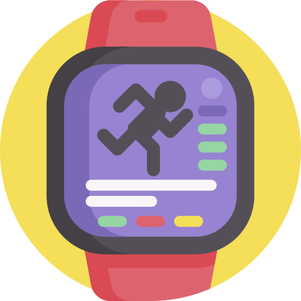

# ❄️ Winter Arc Tracker

<p align="center">
  
</p>

<p align="center">
  <strong>Discipline • Routine • Mastery</strong><br>
  A minimal, offline-first habit tracker designed for your 90-day Winter Arc challenge.
</p>

<p align="center">
  
  
  
  
  
  
</p>

---

## ✨ Features

- 🎯 **Non-Negotiable Habit Tracking**: Track daily habits with boolean checkboxes or numeric targets (e.g., 3000ml water, 45 min workout, 10 pages reading).
- 🧊 **Icy-Blue Minimal Aesthetics**: Distraction-free, modern flat design with subtle ambient glow and full **Dark / Light mode** support.
- 📅 **Interactive Streak Heatmap**: 5-tier intensity calendar visualization reflecting your daily completion consistency and longest streaks.
- 🔔 **Scheduled Local Notifications**: Customizable daily check-in reminders powered by `flutter_local_notifications` and exact timezone alignment.
- 🔒 **100% Offline-First (Hive)**: Instant load times and complete privacy with encrypted local storage.
- ☁️ **Silent Firebase Cloud Backup**: Anonymous background synchronization to Google Cloud Firestore with zero login friction.
- 🛡️ **Hosted Privacy Policy**: Ready-to-deploy GitHub Pages privacy policy template included in `/docs`.

---

## 🛠️ Tech Stack & Architecture

- **Framework**: [Flutter](https://flutter.dev) (iOS, Android, Web, macOS)
- **Language**: [Dart](https://dart.dev)
- **State Management**: [Riverpod 3.0](https://riverpod.dev) (`NotifierProvider`)
- **Local Storage**: [Hive](https://pub.dev/packages/hive) (`hive_flutter`)
- **Cloud Backend**: [Firebase](https://firebase.google.com) (`firebase_core`, `cloud_firestore`, `firebase_auth`)
- **Notifications**: [flutter_local_notifications](https://pub.dev/packages/flutter_local_notifications) & [flutter_timezone](https://pub.dev/packages/flutter_timezone)
- **Typography**: [Google Fonts (Inter)](https://pub.dev/packages/google_fonts)

---

## 🚀 Getting Started

### 1. Prerequisites
- [Flutter SDK](https://docs.flutter.dev/get-started/install) (3.24+ recommended)
- Android Studio / Xcode (for mobile emulator or physical device testing)

### 2. Clone and Install Dependencies
```bash
git clone https://github.com/<YOUR_USERNAME>/<YOUR_REPO_NAME>.git
cd wa_tracker

# Install Flutter packages
flutter pub get
```

### 3. Run the App
```bash
# Run on connected device / emulator
flutter run
```

---

## ☁️ Firebase Configuration

To enable silent cloud backup:

```bash
# 1. Activate FlutterFire CLI
dart pub global activate flutterfire_cli

# 2. Configure Firebase project
flutterfire configure --project=<YOUR_FIREBASE_PROJECT_ID>
```

> **Note**: In your Firebase Console, ensure **Authentication > Sign-in method > Anonymous** is enabled and **Firestore Database** is created.

---

## 📄 Privacy Policy Hosting (GitHub Pages)

The repository includes a ready-to-deploy privacy policy in the [`docs/`](docs/) directory.

To activate:
1. Push your repository to GitHub.
2. Go to **Settings > Pages**.
3. Set **Source**: `Deploy from a branch`, **Branch**: `main`, **Folder**: `/docs`.
4. Your policy will be live at:
   `https://<YOUR_USERNAME>.github.io/<YOUR_REPO_NAME>/`

---

## 📱 Project Structure

```text
lib/
├── core/
│   ├── constants/       # App colors, presets, and defaults
│   └── theme/           # Light & Dark theme definitions
├── models/              # WinterArc, Goal, and DailyEntry models
├── providers/           # Riverpod state notifiers (Arc, Goals, Entries, Reminders, Theme)
├── screens/
│   ├── splash/          # Animated light splash screen
│   ├── onboarding/      # Setup challenge dates, habits & theme
│   ├── home/            # Daily habit checklist & overall streak badge
│   ├── progress/        # Heatmap calendar, statistics & daily breakdown
│   ├── settings/        # Timeline editor, reminders & data reset
│   └── modals/          # Add / Edit habit modal bottom sheet
├── services/            # StorageService (Hive), SyncService (Firebase), NotificationService
└── main.dart            # App entry point
```

---

## 📜 License

Distributed under the MIT License. See `LICENSE` for more information.

---

<p align="center">
  Built with ❄️ for relentless focus and daily discipline.
</p>
